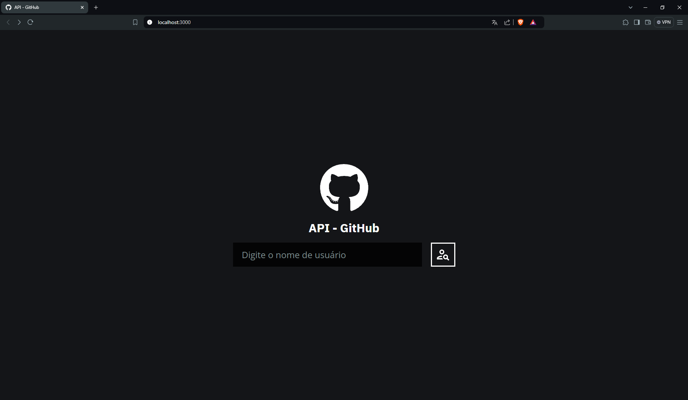
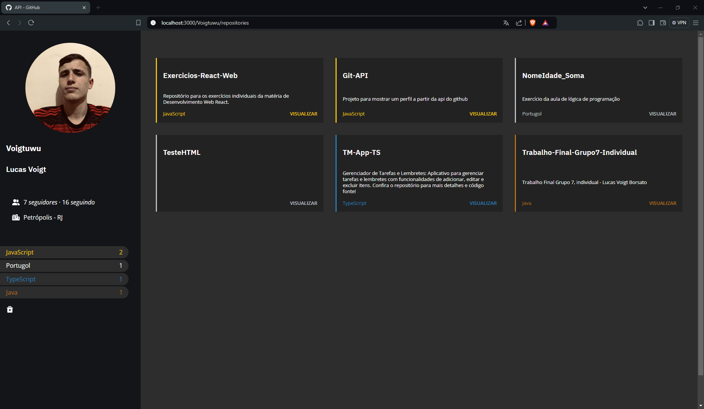

# GitHub API Project

## Descrição

Este projeto é uma aplicação React que utiliza a API do GitHub para buscar os repositórios de um usuário. A aplicação permite filtrar os repositórios de acordo com a linguagem utilizada e também limpar os filtros aplicados. Além disso, exibe a imagem de perfil e algumas informações do usuário pesquisado. Em cada repositório, você pode clicar em "Visualizar" para ser redirecionado ao repositório no site do GitHub.

## Tecnologias Utilizadas

- **React**: Biblioteca para a construção da interface do usuário.
- **React Router**: Para navegação entre páginas.
- **Styled Components**: Para estilização dos componentes com CSS-in-JS. Foi a primeira vez que usei essa tecnologia em um projeto e gostei bastante da sua flexibilidade e simplicidade.
- **GitHub API**: Para buscar informações dos repositórios e do perfil do usuário.
- **Responsividade**: O projeto é totalmente responsivo, garantindo uma boa experiência em dispositivos de diferentes tamanhos.

## Funcionalidades

- **Busca de Repositórios**: Busca os repositórios de um usuário específico utilizando a API do GitHub.
- **Filtro de Linguagens**: Permite filtrar os repositórios de acordo com a linguagem de programação utilizada.
- **Limpar Filtros**: Botão para limpar os filtros aplicados e visualizar todos os repositórios.
- **Exibição de Informações do Usuário**: Mostra a imagem de perfil e informações básicas do usuário pesquisado.
- **Redirecionamento para o GitHub**: Cada repositório possui um link que redireciona para a página do repositório no GitHub.

## Imagens

### Tela Inicial



### Tela de Repositórios



## Como Rodar o Projeto

1. Clone o repositório:
   ```bash
   git clone https://github.com/Voigtuwu/Git-API.git

2. Navegue até o diretório do projeto:
    ```bash
    cd Git-API

3. Instale as dependências:
    ```bash
    npm install

4. Inicie o servidor de desenvolvimento:
    ```bash
    npm start
    
O projeto estará disponível em http://localhost:3000.   

# Contribuições
Sinta-se à vontade para contribuir com melhorias ou correções. Faça um fork do repositório, crie uma branch com suas alterações e envie um pull request.

# Licença
Este projeto está licenciado sob a licença MIT - veja o arquivo LICENSE para mais detalhes.
